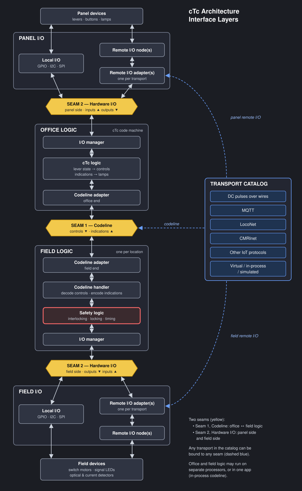

# 0005. Appliance driver architecture: axioms, three layers, primitives × domains

- Status: REJECTED
- Date: 2026-10-08
- Supersedes: ADR 0004 (the driver seam). Builds on ADR 0003 (field I/O symbols: Role, Kind, pins, `~{X}` polarity, naming axioms) and FieldUnit-Subdivision ADR 0004 (WLQK sequence D1–D5, heads as appliances D6, hierarchy D12, field units D13), which stand.
- Order of authority: (1) the relay model of interlocking logic and AAR practice (`docs/GLOSSARY.md` §10.6); (2) FieldUnit `src/`, defective where it differs from (1); (3) KiCad-derived models (symbol libraries, drawings); (4) legacy sketches and harvested profiles, evidence only. The Watsonville drawing is not cited.
- Terms follow `docs/GLOSSARY.md`. "CTC machine" is the glossary term for the office side; this ADR uses it where the brief says "office unit".

Context. ADR 0004 collected a driver seam bottom-up: one request at a time, each shaped by an existing class. The owner's review (ADR 0004 R0–R9, and the brainstorm appended to `FieldUnit-Subdivision/docs/review/appliance-driver-survey-2026-10-08.md`) asked for the opposite: a small set of axioms, an ontology, and an architecture derived from them, with every concrete choice traceable to an axiom or listed as a decision. This ADR does that. Nothing from ADR 0004 below its R-text is carried forward; what survives is re-derived here.
## Comments

REJECTED

Overall:
	This document does not follow ADR structure.  There is no scope, problem statement, definition of done, context...
	It reads like a stream of conciousness flow, starting with a list of decisions required even before any proposals were shown...
	This document would benefit from use of the STE style skill (~/.agents/skills/ste-writing)


51:	3. Ontology
	The ASCII art is corrupted / the '|' bars and whitespace are not aligned with anything...
	It is unclear what is being proposed.  What does left to right mean -vs- top to botom?

67:	Entity table
	the list of entities feels right, but the definitions don't seem precise or stand alone.
	Example: Head	An appliance in its own right (Subdivision ADR 0004 D6); the mast is its heads

69:	Appliance | A vital object
	no, only some appliances are vital objects.  some, like MCall, switch heaters, etc are not.

	an appliance (often referred to as a signal appliance) is any physical, trackside mechanical or electrical device that is interconnected to control or govern the movement of trains
	In railroad Centralized Traffic Control (CTC) and signaling terms, an appliance is any physical, trackside mechanical or electrical device that is interconnected into the signal system to govern and protect train movements. 
	The General Code of Operating Rules (GCOR) explicitly refers to these as "signal appliances". Common examples include: 

	* Track switches / turnouts (and their motorized power switch machines)
	* Wayside signals (absolute and intermediate signals)
	* Electric switch locks
	* Movable-point frogs and derailers 

	These appliances are interlocked, meaning they are electrically wired and logically connected so they cannot operate out of sequence.  Also known as "vital" or "life-safety" protected.
	For example, the system will prevent a switch from moving if a signal is cleared over it, and it will prevent a signal from turning green if the switch appliance isn't fully locked in the correct position. 

	The Maintainer Call (MC) is considered a signal appliance.
	A Maintainer Call is a dispatcher-controlled field device—typically a prominent white light and/or a horn mounted on the outside of a trackside relay house or bungalow at a control point. 
	While it doesn't physically move track like a switch machine, it fits the definition of a signal appliance for several reasons:

	   1. It is an interconnected field device: It is hardwired directly into the remote interlocking housing and the CTC system. 
	   2. It is operated by the CTC machine: The train dispatcher activates it by flipping a dedicated toggle switch or clicking a command on their console and sending a "code" to the field. 
	   3. It governs employee actions: When the light is illuminated, railroad operating rules require any employee (not just the signal maintainer, but also track workers or train crews) who sees it to immediately stop and contact the train dispatcher via radio or a wayside telephone. 
	   4. Since the Maintainer Call's operation does not directly impact the movement of trains, it is not interlocked with other parts of the system, allowing it to be activated at any time.

	Historically, before mobile radios were common, it was the primary way a dispatcher could flag down a signal maintainer or track crew working in the field to tell them to call the office. 

71:	| Shape (cluster) | A named surface: commands + attributes + notifications | one per appliance shape
	This is an ambiguous and recursive definition - can't use shape to define shape...
	Is an appliance itself a shape, or is a family of appliances a shape?  i.e., is "vita;" a shape, or is "switch" a shape, or is "electrically operated remote switch" a shape?...

83:	The three layers and their seams
	I need a picture and/or some examples before diving into word salad...

85:	Layer 1: vital objects (unchanged in principle)
	Why "vital objects" and not "appliances"?
	This ties back to the ontology - it defines Appliance, but not vital object...
93:	Seam 1→2: appliance shapes
	Should instead this be a shape per appliance type?
	How are the appliance (i.e., a signal), the dispatcher controls for the appliance (the levers and lamps associated with a ssignal on the machine), the field logic (safety, relays...) and hardware interconnects differentiated?
	This table seems to conflate both the "where" (dispatcher, machine, field, plant) and the "what"...

	This could be because this document doesn't define its scope and where it fits in the larger picture, but however we got here, the lack of precision here makes it hard to tell if this proposal actually holds up.

122:	Seams..
	This level of detail is impossible to review without a stronger overview picture
	It uses "primitive" and "domain", but they aren't defined on the ontology; the entity list simply lists them with no detail or axiom that says why a Light is a primitive...

141:	Code...
	Why is there CODE in an architectural document?  
260:	Migration notes...
	Again, this is out of scope for a proposal.  Including it jakles the proposal way too hard to comprehend because it builds way too much on top of unproven and unvalidated assumptions.
	It is those assumptions and relationships that are the important part of a document like this.  The rest goes into a project plan that is created in response to an approved ADR...


cTc Architecture — Interface Layers

The key to taming the combinatorics: **separate the *role* of a link from the *transport* that carries it, and separate *logic* from the *host* it runs on.**

- There are two seams. The codeline (Seam 1) runs between office logic and field logic. Hardware I/O (Seam 2) appears twice: once for the panel and once for each field location.
- Transports come from one shared catalog and can be bound to any seam.
- Office logic and field logic can run on separate processors, or in one host app. In the one-host case the codeline is in-process.

Layers and seams



Transport × seam binding matrix

| Transport | Seam 1: Codeline | Seam 2: Local I/O | Seam 2: Remote I/O |
|---|:-:|:-:|:-:|
| DC pulses over wires | ✅ | — | — |
| MQTT | ✅ | — | ✅ |
| LocoNet | ✅ | — | ✅ |
| CMRInet | ✅ | — | ✅ |
| Other IoT | ✅ | — | ✅ |
| Virtual / in-process / simulated | ✅ | ✅ | ✅ |
| GPIO / I2C / SPI | — | ✅ | — |

Seam 2 applies equally to the panel side and the field side. A single I/O seam can use several transports at once, for example CMRInet nodes alongside LocoNet nodes.

**Note:** when one bus carries both roles, keep codeline and I/O traffic on separate topic trees or address ranges, so each adapter only handles messages for its own seam.

Play-test against use cases

| Element | 1 · Physical I/O with MQTT codeline | 2 · Distributed I/O with CMRInet |
|---|---|---|
| Office logic host | Office processor | One host app |
| Field logic host | Field processor at each location | Same host app |
| Seam 1: codeline | MQTT (or LocoNet) between processors | Virtual / in-process |
| Seam 2: panel side | Local I/O: GPIO / I2C to levers and lamps | Remote I/O: CMRInet nodes in the machine |
| Seam 2: field side | Local I/O: GPIO / I2C to motors, LEDs, detectors | Remote I/O: CMRInet nodes, optionally also LocoNet or MQTT nodes |
| Remote I/O used | No | Yes, possibly mixed transports |


## 1. Decisions requested

Each line is one decision with a default in italics. Accepting the defaults accepts the architecture as written.

1. Primitives: keep the four, Light, Level, Position, Contact; no fifth. A twin-coil (pulse) machine is outside the 95% set of ADR 0003 D5. *Default: keep four; Pulse deferred.*
2. Shape names: appliance shapes `SwitchMachine`, `Head`, `Detector`, `Lamp`, `Lever`; primitive shapes `Light`, `Level`, `Position`, `Contact`; channel shapes `Bit`, `Duty`, `Angle`, `Pixel`. *Default: these; glossary entries added under [FieldUnit].*
3. `(Role, Kind)` re-key: a DEVICE or PANEL Kind names the appliance shape plus packaging and feedback (`HEAD_3LAMP`, `SWITCH_STALL_SENSED`), never the domain; the domain is read from the bus pin the part is wired to; the table gains PRIMITIVE and ENCODER sections and an explicit `shape` field (no `kind.split("_")[0]`, `lint_libraries.py:95`). *Default: yes.*
4. Pin typing: device, panel and encoder-output pins are typed by primitive (LIGHT, LEVEL, POSITION, CONTACT); bus and encoder-input pins by channel (BIT, DUTY, ANGLE, PIXEL); a net is legal when the primitives × domains table admits the pair. This supersedes ADR 0003 D10's same-type rule. *Default: yes.*
5. Lamps and levers: PANEL and DEVICE lamps are one `Lamp` shape (one Light plus a token binding); PANEL levers and DEVICE contacts are one `Lever` shape. `PANEL/LAMP_PWM`, `PANEL/LAMP_NEOPIXEL` (proposed rows) are withdrawn; `DEVICE/LAMP_BIT|PWM|NEOPIXEL` become `LAMP`. *Default: yes.*
6. Head device Kinds: `HEAD_3LED`, `HEAD_3LED_PWM`, `HEAD_3LED_MUX2` → `HEAD_3LAMP`; `HEAD_1LED_PWM`, `HEAD_1LED_NEOPIXEL` → `HEAD_1LAMP`; `HEAD_SEMAPHORE_SERVO` → `HEAD_SEMAPHORE`; add `HEAD_SEARCHLIGHT` (vane Position + lamp Light) and, later, `HEAD_CPL`. *Default: yes.*
7. Detectors: `DETECTOR_OPTICAL` and `DETECTOR_CURRENT` → one `DETECTOR` with `Hold_ms` (0 = no hold). *Default: merge.*
8. Contact classification: `Switch` takes raw contacts (`reportContacts(n, r, now)`) and derives NWCR/RWCR/KR, MOVING and OUT_OF_CORRESPONDENCE itself; no driver classifies. *Default: Switch.*
9. Optical hold: moves from `TrackCircuit::dropoutDelayMs_` to the `Detector` shape's `Hold_ms`; the vital object keeps only staleness. *Default: Detector.*
10. Flash: one flasher per unit (field unit or CTC machine) from `timing.flash_ms`; a Light carries `flash: bool`; no per-lamp rate. *Default: one flasher, no rate.*
11. Head compatibility (every signal indication a signal's routes can produce is renderable by every head's device under the layout's rulebook): checked by the codegen; `begin()` refuses only unresolved bindings. *Default: codegen.*
12. `MqttApplianceBus`: retired as a driver. The sensor and turnout topics become an MQTT bit bus (SEAM-2, Bit channels); the signalmast aspect-name topic becomes an optional layer-2 observer of the signal's aspect, not a driver; nothing binds the whole plant. *Default: as stated.*
13. `CmriIOBus`: kept as a SEAM-2 bus offering Bit channels, one bus instance per node address. *Default: keep, re-based on `Bus`.*
14. `PanelHardware`, `PanelInput`, `PanelOutput`: retired; the CTC machine uses layers 2 and 3 unchanged, with the MAX7313 as an IODRIVER bus and lamps bound by token. *Default: retire.*
15. Encoders: new Role `ENCODER` (naming axiom 4 gains one Role) with `Encoder-Mux-2:4` and `Encoder-PixelChain-N` first, charlieplex later; a 74HC595 chain is an IODRIVER row (it offers channels), not an encoder. *Default: yes.*
16. IODRIVER rows gain capability columns (direction programmable, pull-up, invert, frequency, drive mode) and new rows: MCU GPIO, NeoPixel data pin (PIXEL), 74HC595 chain, CMRI node, MQTT bits. *Default: yes.*
17. `Aspect` splits into `HeadAppearance {color, flashing, position, markers}` (per head, vocabulary selected by the head's plant Kind) and a signal-aspect name used only for exports; `AspectPolicies` become rulebook charts keyed by `(rulebook, head Kind, head identity, indication)`. *Default: yes.*
18. Rulebook charts are data (TOML in FieldUnit-Subdivision, generated into a C++ table) so the codegen check and the runtime read one source. *Default: data.*
19. Lamp test and maintainer modes address parts by name (`2NA.Y`), gated by the unit's `mode.*` keys; Lights render test patterns, Levels and Positions never do. *Default: as stated.*
20. Polarity notation under decision 4: `~{X}` is allowed only on a pin whose primitive admits BIT and applies only when the part is bound to a Bit channel. *Default: yes.*
21. Codegen output form for the records of §6 (generated constexpr tables compiled into the sketch, or JSON loaded at start). This is the standing open question of `AGENTS.md` "Direction". *Default: constexpr tables, so a bad record fails at compile.*

## 2. Axioms

1. One fact, one source. A hardware fact is drawn once (netlist, symbol instance) or ruled once (the `(Role, Kind)` table, the rulebook chart); code is generated or validated from it, never a second copy.
2. Decisions are vital and live in layer 1. Everything below renders a decision already made or reports a raw observation; nothing below judges.
3. A driver sees only its own appliance and its own domain. Routes, locks, other appliances and the code line are structurally out of its reach.
4. Composition is derived. The tree mast → head → part → encoder → channel is read from the plant and the netlist; it is never drawn twice and never typed in code.
5. The mapping maintained by hand is primitives × domains. Appliances are compositions of primitives; a new appliance adds a composition, not a driver per domain.
6. Symbolic until the last step. Above the channel, values are colour, brightness ratio, angle, asserted/not; physical units (duty counts, pulse widths, sink/source) exist only inside the domain adapter.NOTE: This "above" list is still not the internal FieldUnit vocabulary.  It uses Indication/aspect, relay and token names, etc.  the chain is
INDICATION (CLEAR, APPROACH, ..., STOP) => ASPECT => translation to device domain => color/angle => PWM/1/0...
1. Names are stable and addressable. Every node of the tree is named from its appliance name and pin name (`2NA.Y`, `835.N`) and can be reached by that name without the interlocking.
2. Layers 2 and 3 are identical across deployments A (virtual), B (firmware near the devices) and C (host over SEAM-2); only the bus implementation differs.
3.  Fail early. What the drawing can prove, the codegen checks; what the chip cannot do, the bus refuses at `begin()`; nothing degrades silently.
4.  Two contexts, kept apart. Appliance context (the symbol instance and its row; the device type owns its meaning) and layout context (the registry `schemas/context/keys.toml`; shared, read-only to drivers).

## 3. Ontology

```
 layer 1  Appliance ──1:N── Head                         vital objects; office: lever and lamp state
             │                │
 layer 2  DeviceType (a (Role,Kind) row) presents one appliance Shape
             │  composed of N named Parts, each one Primitive  (name = appliance.pin)
             │                │
          Encoder  (pure transform: K Parts → M Channels)  0..N between a Part and its Channel
             │                │
 layer 3  Channel (bus, index, ChannelType, config)  ──N:1── Bus (an IODRIVER instance)
                                                                  ──N:1── Domain (SEAM-1 chip, SEAM-2 link, mock)
 contexts  ApplianceContext: instance attributes + row defaults     LayoutContext: keys.toml, per unit
 identity  HeadIdentity (mast, letter, index from top, dwarf, plant Kind): opaque above layer 2
```

| Entity | Definition | Cardinality | Owner |
|---|---|---|---|
| Appliance | A vital object (`Switch`, `SignalMast`, `TrackCircuit`); on the CTC machine, a lever or lamp state | 1 appliance : 0..N device types (a `SWITCH_LOCK` with a sense device and a fascia plate) | layer 1 |
| Head | An appliance in its own right (Subdivision ADR 0004 D6); the mast is its heads | mast 1 : 1..N heads; head 1 : 1 device type | layer 1 (state), layer 2 (rendering) |
| Shape (cluster) | A named surface: commands + attributes + notifications | one per appliance shape, primitive, channel type | the layer that presents it |
| Device type | A `(Role, Kind)` row: the shape it presents, its parts by pin name, its attributes, its logic block | one row : many instances | layer 2 |
| Part / primitive | One Light, Level, Position or Contact with a stable name | device type 1 : 1..N parts | layer 2 (value), layer 3 (binding) |
| Encoder | A pure transform from part values to channel values, drawn as a symbol | part 0..N encoders : channel | layer 2 (symbolic) |
| Channel | One addressable unit of a bus with its configuration record | part or encoder output 1 : 1 channel | layer 3 |
| Bus / domain | An IODRIVER instance implementing `Bus` for one domain | plant 1 : N buses | layer 3 |
| Composition tree | The resolved appliance → … → channel graph, emitted as records and as a report | one per field unit | codegen |
| Appliance context | Instance attributes with row defaults (`NormalIs`, `Hold_ms`, `Stop_deg`, `Color`, polarity per pin) | one per device instance | device type |
| Layout context | `era.*`, `rulebook.*`, `timing.*`, `motion.*`, `color.*`, `light.*`, `clock.*`, `mode.*` | one per unit | environment |

Matter/Zigbee vocabulary is used loosely and only here: cluster = shape; endpoint = a named part or device instance; device type = a row's required shape set. No Matter mechanics (attribute ids, reporting, fabrics) are imported.

## 4. The three layers and their seams

### Layer 1: vital objects (unchanged in principle)

`Switch`, `SignalMast`, `TrackCircuit`, `SignalControl`, and on the CTC machine `PanelColumn`/`CtcStation`. Changes required by axiom 2 and authority (1):

- `Switch` receives raw contacts and classifies them itself. Today `SwitchDriver.h:38-48` turns `{N,R}` into MOVING or OUT_OF_CORRESPONDENCE; under the relay model `NWCR = NW control ∧ points detected normal`, `KR = NWCR ∨ RWCR` (`GLOSSARY.md` §10.5), and the travel timeout is already in `Switch::tick` (`Switch.h:212-218`). `updateFeedback(SwitchPosition)` (`Switch.h:224-226`) becomes `reportContacts(bool n, bool r, uint32_t now)`.
- `SignalMast` holds one `HeadAppearance` per head, with the head list from the model, not from `MastType` (`SignalMast.h:9-14, 44-52`). `setIndication` (`:102-109`) asks the rulebook chart per head.
- `TrackCircuit` keeps occupancy, quality and staleness; the release hold leaves (`TrackCircuit.h:12, 60-87`).

### Seam 1→2: appliance shapes

Language-neutral surfaces. Commands flow down, attributes are read, notifications flow up. The lifecycle of every layer-2 object is `begin(records) / sample(env) / drive(env) / end()`, called by the unit in the existing order sample → evaluate → drive (`InterlockingPlant.h:504-516`).

| Shape | Commands (from layer 1) | Attributes (read by layer 1) | Notifications |
|---|---|---|---|
| SwitchMachine | `throw(NORMAL\|REVERSE)` | `contacts {n, r}` raw, `quality`, `moving` (mechanism) | ContactsChanged, Fault |
| Head | `show(HeadAppearance)` | `current`, `previous`, `since`, `moving` (blade or vane in transit) | Fault (lamp out) |
| Detector | none | `occupied`, `quality` | Changed |
| Lamp | `set(asserted, blink)` | `lit` | Fault |
| Lever | none | `position` (N/R; L/N/R; key in/out; button down) | Moved |

`Switch` reads `contacts` and judges. `SignalMast` calls `show`. `TrackCircuit::update(occ, quality, now)` is fed by `Detector`. On the CTC machine, `PanelColumn` reads `Lever.position` for its controls and calls `Lamp.set` from the indication vector, with `WLQK` blink and `WLK` steady per Subdivision ADR 0004 D4/D5 decided in the `LOCK_LEVER*` device types, not on a pin.

### Layer 2: symbolic rendering

Built from the composition records. Three kinds of object:

- Device-type renderers, one class per appliance shape and packaging (the row's logic block): `Head3Lamp`, `Head1Lamp`, `HeadSemaphore`, `HeadSearchlight`, `HeadCpl`; `SwitchMachine` (stall or servo, sensed or simulated, by which parts exist); `Detector`; `Lamp`; `Lever`. They turn a command into part values and part samples into attributes. They hold mechanism state only (vane in transit, blade moving, hold timer, simulated travel).
- Primitives: `Light {on, brightness, color, flash, flicker}`, `Level {high}`, `Position {targetDeg, speed}`, `Contact {closed, quality, since}`.
- Encoders: `Mux2x4` (four Lights → two Bit channels), `PixelChain` (N Lights → one Pixel channel's slots).

The environment resolves time once per tick: the unit's flasher phase (`timing.flash_ms`, `keys.toml:46-50`), daylight (`clock.daylight`), brightness and gamma (`light.*`), test modes (`mode.*`). A Light's effective value (`on ∧ (¬flash ∨ phase)`) is computed in `drive` before encoders and cells see it; no driver owns a clock (today `SignalMastDriver.h:32`, `CplMastDriver.h:55`).

Head appearance. `HeadAppearance {color: DARK|RED|YELLOW|GREEN|LUNAR, flashing, position: HORIZONTAL|DIAGONAL|VERTICAL|NONE, markers}`; the head's plant Kind says which fields carry meaning (`HEAD_COLOR_LIGHT`: colour and flashing; `HEAD_SEMAPHORE_2POS/3POS`: position, the lamp lit by daylight; CPL: colour as disk angle plus markers). The rulebook chart `appearance(rulebook, HeadIdentity, Indication)` replaces `AspectResolver(ind, headCount, isDwarf)` (`SignalAspectPolicy.h:24`); `HeadIdentity` is the opaque handle of ADR 0004 R7. `Aspect` (`types.h:117-142`) stops being a head value.

- Searchlight: device `HEAD_SEARCHLIGHT` = vane `Position` + lamp `Light`. `show(GREEN)` from RED moves the vane through the centre (yellow) position; `moving` is true for the transit time; `previous` and `current` are the only state. A three-colour LED searchlight is `HEAD_3LAMP` on the same plant Kind; the transit is then a cross-fade on Duty, nothing on Bit.
- Semaphore: device `HEAD_SEMAPHORE` = arm `Position` + lamp `Light`. `show({position: HORIZONTAL})` writes `Stop_deg` at `motion.speed`; the lamp is lit when `clock.daylight` is false; a two-position head refuses DIAGONAL (caught statically by decision 11).

### Seam 2→3: primitives × domains

The only hand-maintained mapping (axiom 5). Six cells today:

| Primitive | Bit | Duty | Angle | Pixel |
|---|---|---|---|---|
| Light | `LightOnBit` (effective on → asserted) | `LightOnDuty` (brightness × gamma; fade) | | `LightOnPixel` (colour × brightness → slot) |
| Level | `LevelOnBit` (`NormalIs`) | | | |
| Position | | | `PositionOnAngle` (deg, speed) | |
| Contact | `ContactOnBit` (asserted → closed; quality from bus health) | | | |

A part binds to one channel, directly or through encoders. Debounce, pull-up, inversion and frequency are channel configuration, applied by the bus.

### Layer 3: channels and buses

One `Bus` interface for every domain; capability is expressed by `configure` refusing what the chip cannot do (ADR 0004 R5, now with scope). Direction comes from the drawing (R6): a device pin's KiCad electrical type says what the device does to its wire (`Device-Switch-StallMotor-Sensed` has `M` input, `~{N}`/`~{R}` output; `Driver-I2C-MCP23017` pins are bidirectional and are configured as the complement; `Driver-I2C-PCA9685` pins are output only). Polarity from `~{X}` or the instance override (ADR 0003 D6), pull-up where an asserted-low input lands on a programmable pin (Subdivision ADR 0004 D8). The bus applies these in hardware where it can (MCP23017 IODIR, GPPU, IPOL), in software where generic (polarity on a CMRI byte), and refuses otherwise (an input on a PCA9685).

Deployments: A binds every bus to `MockBus`; B binds `Mcp23017Bus`, `Pca9685Bus`, `GpioBus`, `NeoPixelBus`; C binds `CmriBus` or `MqttBitBus` over SEAM-2. The records and layers 2 and 3 are the same file in all three (axiom 8).

### Minimal C++17 sketch (no implementation)

```cpp
namespace FieldUnit {
enum class ChannelType : uint8_t { BIT, DUTY, ANGLE, PIXEL };
enum class Dir : uint8_t { IN, OUT };
struct ChannelSpec { uint8_t index; ChannelType type; Dir dir; bool assertedLow; bool pullup; bool invert; uint16_t freqHz; uint8_t driveMode; };

class Bus {                                   // layer 3: one interface per domain
public:
  virtual bool configure(const ChannelSpec&, const char** reason) = 0;   // at begin(); chip, software, or refuse
  virtual void begin() = 0;
  virtual void sample(uint32_t nowMs) {}      // latch inputs
  virtual void flush(uint32_t nowMs) {}       // commit outputs
  virtual bool readBit(uint8_t ch) { return false; }
  virtual void writeBit(uint8_t ch, bool asserted) {}
  virtual void writeDuty(uint8_t ch, uint16_t ratio) {}
  virtual void writeAngle(uint8_t ch, uint16_t deg, uint8_t speed) {}
  virtual void writePixel(uint8_t ch, uint8_t slot, uint32_t rgb) {}
  virtual Quality health() const { return Quality::GOOD; }
};

struct Env { uint32_t nowMs; bool flashPhase; bool daylight; uint8_t brightness; bool lampTest; };

struct Part  { const char* name; };                                   // "2NA.Y"
struct Light : Part { bool on; uint8_t brightness; uint32_t color; bool flash; uint8_t flicker; bool fault;
                      bool effective(const Env& e) const { return on && (!flash || e.flashPhase); } };
struct Level : Part { bool high; };
struct Position : Part { uint16_t targetDeg; uint8_t speed; bool moving; };
struct Contact : Part { bool closed; Quality quality; uint32_t sinceMs; };

struct Cell { virtual void begin(Bus&, const ChannelSpec&) = 0; virtual void sample(const Env&) {} virtual void drive(const Env&) {} };
struct LightOnBit : Cell { Light* l; Bus* bus; uint8_t ch; void drive(const Env& e) override { bus->writeBit(ch, l->effective(e)); } };
struct ContactOnBit : Cell { Contact* c; Bus* bus; uint8_t ch; void sample(const Env& e) override; };
struct Mux2x4 : Cell { Light* in[4]; Bus* bus; uint8_t s0, s1; void drive(const Env& e) override; };   // encoder

enum class HeadColor : uint8_t { DARK, RED, YELLOW, GREEN, LUNAR };
enum class HeadPosition : uint8_t { NONE, HORIZONTAL, DIAGONAL, VERTICAL };
struct HeadAppearance { HeadColor color; bool flashing; HeadPosition position; uint8_t markers; };
struct HeadIdentity { const char* mast; char letter; uint8_t indexFromTop; bool dwarf; uint8_t plantKind; };
using Rulebook = HeadAppearance (*)(const HeadIdentity&, Indication);   // a chart lookup, data behind it

struct HeadRenderer { virtual void show(const HeadAppearance&, const Env&) = 0;
                      virtual bool canShow(const HeadAppearance&) const = 0; virtual bool moving() const { return false; } };
struct Head3Lamp : HeadRenderer { Light *r, *y, *g, *l; };
struct HeadSemaphore : HeadRenderer { Position* arm; Light* lamp; uint16_t stopDeg, approachDeg, clearDeg; };
struct HeadSearchlight : HeadRenderer { Position* vane; Light* lamp; HeadColor previous; uint32_t transitStartMs; };

struct SwitchMachine { Level* motor; Position* servo; Contact *n, *r; bool simulated; uint32_t travelMs;
                       void drive(SwitchPosition commanded, const Env&); bool contactN() const; bool contactR() const; };
struct Detector { Contact* occ; uint32_t holdMs, lastShuntMs; bool occupied(const Env&) const; Quality quality() const; };
struct Lamp     { Light* light; void set(bool asserted, bool blink) { light->on = asserted; light->flash = blink; } };
struct Lever    { Contact* c[3]; uint8_t position() const; };
} // namespace FieldUnit
```

Layer 1 attaches by name: `plant.attach("835", switchMachine)`, `plant.attach("836NAB", headRenderers)`, replacing `overrideDriver(name, ApplianceDriver*)` with its `void*` (`DriverPolicy.h:21-27, 105-123`).

### Worked decompositions

Names are `appliance.pin`; channels are `bus@address.pin`. Read from the Sargent drawing's Values and the library pin sets; the netlist pairing was not run (`make netlist`), so the bindings below are the drawing's intent, not verified nets.

```
836NAB (Mast_Double)                       plant heads A, B: HEAD_COLOR_LIGHT
 ├─ 836NA [Head3Lamp]  Lights 836NA.R 836NA.Y 836NA.G ─[Mux2x4]─ 836NA.S0 836NA.S1 ─ MCP23017@0x21.A1 A2  (Bit out)
 └─ 836NB [Head3Lamp]  Lights 836NB.R 836NB.Y 836NB.G ─[Mux2x4]─ 836NB.S0 836NB.S1 ─ MCP23017@0x21.A3 A4
836SA  (Mast_Single)   head A: HEAD_COLOR_LIGHT
 └─ 836SA [Head3Lamp]  Lights 836SA.R 836SA.Y 836SA.G ──────────────────────────────── PCA9685@0x27.A1 A2 A3 (Duty)
836SB  (Mast_Dwarf)    drawn as HEAD_COLOR_LIGHT; device is HEAD_SEMAPHORE          ← decision 11 catches this
 └─ 836SB [HeadSemaphore] Position 836SB.ARM ─ PCA9685@0x27.A4 (Angle); Light 836SB.LAMP ─ PCA9685@0x27.A5 (Duty)
835    (Switch_Lock, SWITCH_STALL_SENSED -OS)
 └─ 835 [SwitchMachine] Level 835.M (NormalIs=HIGH) ─ MCP23017@0x20.B1 (Bit out)
                        Contacts 835.N 835.R ─ MCP23017@0x20.B2 B3 (Bit in, pull-up, asserted-low)
     835T1 [Detector]   Contact 835.OCC ─ MCP23017@0x20.B4 (Bit in)        → TrackCircuit 835T1
1NAT   (Track Circuit)
 └─ 1NAT [Detector, Hold_ms=1500] Contact 1NAT.OCC ─ MCP23017@0x20.A5 (Bit in)  → TrackCircuit 1NAT
835    desk PanelLock (LOCK_LEVER_2LAMP_2CONTACT)         CTC machine, column c
 └─ [Lever] Contacts 835.WLS 835.~WLS ─ MAX7313@c.A1 A2 (Bit in)
    [Lamp]  Light 835.WLK  (N lamp; blinks on WLQK)      ─ MAX7313@c.A3 (Bit out)
    [Lamp]  Light 835.~WLK (R lamp; lit on WLK)          ─ MAX7313@c.A4
835    fascia Local-Lock (LOCK_LEVER)
 └─ [Lever] Contact 835.WLQ ─ MCP23017@0x21.B1 (Bit in)
    [Lamp]  Light 835.WLQK (amber: blink while waiting, steady on WLK) ─ MCP23017@0x21.B2
    [Lamp]  Light 835.WLK  (green: lit while locked)                   ─ MCP23017@0x21.B3
HBA    (AUXILIARY) [Lamp] Light HBA.LAMP ─[PixelChain slot 1]─ NeoPixel@GPIO.D1 (Pixel)
```

## 5. The KiCad side

### The reimagined field symbol set

Three symbol families, one per ontology level, all in `RailroadField` (desk twins in `RailroadPanel`):

- Device symbols are primitive packagings named for the appliance shape: `Head-3Lamp` (`~{R}`, `~{Y}`, `~{G}` LIGHT in), `Head-4Lamp` (+`~{L}`), `Head-1Lamp` (`~{LAMP}` LIGHT in, colour-capable), `Head-Semaphore` (`ARM` POSITION in, `LAMP` LIGHT in), `Head-Searchlight` (`VANE` POSITION in, `LAMP` LIGHT in), `Switch-Sense` (`~{N}`, `~{R}` CONTACT out), `Switch-Stall[-Sensed][-OS]` (`M` LEVEL in [+ contacts] [+ `~{OCC}` CONTACT out]), `Switch-Servo[-Sensed]` (`CH` POSITION in), `Detector` (`~{OCC}` CONTACT out; `Hold_ms`), `Lamp` (`~{LAMP}` LIGHT in), `Contact` (`~{IN}` CONTACT out). `Local-Switch`, `Local-Lock`, `Local-Lamp` keep Role PANEL with pins typed LIGHT and CONTACT. The `-PWM`, `-NeoPixel`, `-Mux2`, `-Bit` symbols are deleted; the domain is where the wire lands.
- Encoder symbols, Role `ENCODER`: `Encoder-Mux-2:4` (`L0..L3` LIGHT out, `S0`, `S1` BIT in), `Encoder-PixelChain-8` (`SLOT1..SLOT8` LIGHT out, `DIN` PIXEL in; slot = pin number, so `Chain`/`Index` attributes go). Electrical types follow the same rule: an encoder drives the device's wire (output) and is driven by the bus (input).
- Bus symbols, Role `IODRIVER`, Kind per chip or link, Value = address: `Driver-I2C-MCP23017` (BIT bidir), `Driver-I2C-PCA9685` (DUTY|ANGLE out), `Driver-I2C-MAX7313` (BIT bidir), new `Driver-GPIO` (BIT bidir, DUTY out, PIXEL out), `Driver-SPI-74HC595` (BIT out), `Driver-CMRI-Node` (IB BIT in, OB BIT out), `Driver-MQTT-Bits`.

### What the (Role, Kind) table becomes

- `[[primitive]]` rows (4): name, value fields, admissible channel types, and the cell class per type. This is the primitives × domains table in one place.
- `[[row]]` DEVICE and PANEL rows (device types): `shape`, `parts = { pin → primitive }`, `attributes` with `context`, `block` (renderer class). No domain in the Kind, no `family`, no class per domain.
- `[[row]]` ENCODER rows: `inputs = { pin → primitive }`, `outputs = { pin → channel }`, `block`.
- `[[row]]` IODRIVER rows: pins → channel type(s), `capabilities = { direction, pullup, invert, frequency, mode }`, `block` (bus class).
- APPLIANCE, TRACK, POLICY, STRUCTURE, MACHINE, COLUMN, CODELINE rows unchanged.

Compositions are not rows. The compiler reads the plant (masts, heads, switches, circuits, tokens) and the netlist (device → encoder → bus pins) and joins them by Value (ADR 0003 rule 1).

### What the codegen emits

Data, not code (axiom 1, decision 21): per field unit, `buses[]` (kind, address, capabilities), `channels[]` (bus, index, type, dir, polarity, pull-up, invert, frequency, mode), `parts[]` (name, primitive, binding: channel or encoder input), `encoders[]` (kind, inputs, outputs), `devices[]` (kind, shape, appliance, parts, attributes), `heads[]` (mast, letter, index, plant Kind), plus the composition report in the tree form above and the diagnostics of §6. The CTC machine gets the same records per column with tokens in place of appliance names.

## 6. Test seams

- Layer 1: existing tests, with `Switch` tests feeding contacts instead of positions and `TrackCircuit` tests without the hold.
- Layer 2: a renderer plus a recording part sink, no bus. Given a composition record and a command (`show`, `throw`, a token state), assert part values, mechanism state and `canShow`. Rulebook charts are tested as data: every `(rulebook, head Kind, indication)` pair yields an appearance the Kind admits.
- Layer 3: each cell and each encoder against `MockBus` (records configure/write calls, injects reads and health); each real bus against a chip fake for `configure` (accept, software-emulate, refuse). Truth tables for `Mux2x4` and `PixelChain`.
- Deployment: one plant built three times (MockBus, chip buses, CmriBus) against the same records; the layer-2 trace must be identical.
- Static checks in the codegen, all errors unless noted: head compatibility against the rulebook (decision 11; the 836SB case above); part primitive × channel type admissible; part direction vs bus capability (a CONTACT on a PCA9685; a pull-up needed on a chip without one); two parts on one channel, or a net with two bus pins; unresolved names (device Value not an appliance or head of this interlocking, head letter not on its mast, token not in the plant's token set); `~{X}` on a non-Bit binding; encoder arity; `SIM` feedback (warning, ADR 0003 rule 4); `SWITCH_LOCK` without a motor (Subdivision ADR 0004 D10); a device not on the field unit that hosts its appliance (D13).

## 7. Migration notes (FieldUnit `src/`, by file)

- `types.h`: `Aspect` split per decision 17; `HeadColor`, `HeadPosition`, `HeadAppearance` new; `SwitchPosition` unchanged (it is `Switch` state); `CplMarker` moves to the CPL renderer.
- `SignalMast.h`: `MastType` and `headCount()` from the model; `head1/2/3()` → `head(i)` returning `HeadAppearance`; `compositeAspect()` → an export-only aspect name; `setAspectPolicy` → `setRulebook`.
- `SignalAspectPolicy.h`: `MastAspects`, `AspectResolver` and the eight policies retired; replaced by generated chart tables and one lookup.
- `Switch.h`: `updateFeedback(SwitchPosition)` → `reportContacts(n, r, now)`; classification and timeout stay here.
- `TrackCircuit.h`: `dropoutDelayMs_`, `setDropoutDelay`, `clearingActive_` retired; staleness stays.
- `drivers/IOBus.h`, `IOBit.h`: replaced by `Bus`, `ChannelSpec`; `MockIOBus` → `MockBus`. `InputBit`/`OutputBit` typing is replaced by `ChannelSpec.dir` from the drawing.
- `drivers/I2CexpanderIOBus.h`: becomes `Mcp23017Bus` with `configure` (direction, pull-up, polarity on chip).
- `drivers/CmriIOBus.h`: becomes `CmriBus` (decision 13).
- `drivers/MqttApplianceBus.h`: split per decision 12; the `#include "../InterlockingPlant.h"` and `bind(InterlockingPlant&)` (`:13, 121-131`) go.
- `drivers/SwitchDriver.h`, `TrackCircuitDriver.h`, `SignalMastDriver.h`, `SemaphoreDriver.h`, `CplMastDriver.h`: retired; replaced by `SwitchMachine`, `Detector`, `Head3Lamp`, `Head1Lamp`, `HeadSemaphore`, `HeadSearchlight`, `HeadCpl` and the six cells.
- `drivers/DriverPolicy.h`: `ApplianceDriver(void*)`, `DriverPolicy`, `IoBitDriverPolicy` (fixed arrays of three driver types, `:164-232`), `MqttDriverPolicy`, `MockSwitchDriver` retired; simulation is `SwitchMachine.simulated`.
- `InterlockingPlant.h`: `setDefaultDriverPolicy`, `overrideDriver`, `mockSwitch` → `attach(name, renderer)`; `sampleInputs`/`driveOutputs` iterate buses, cells, renderers.
- `cTcMachine.h`: `PanelHardware`, `PanelInput`, `PanelOutput` (`:21-45, 100-109`) retired; `PanelColumn::readInputs`/`applyIndications` (`:224-258`) use `Lever`/`Lamp` bound by token; `OneShot` stays (it is CTC-machine behaviour, not a driver).
- `examples/spcoast_ctc/IO-I2C.h`: `PanelIO` (`colToDev = col-1`, mask `0x1EC4`) replaced by `Max7313Bus` plus generated records.
- `WireCodec.h`: unchanged (SEAM-0); `WLQK` added per Subdivision ADR 0004.
- New: `src/shapes/`, `src/render/`, `src/primitives/`, `src/encoders/`, `src/bus/`.

## 8. Open items (not decisions)

- Chart source and checker: if charts are data (decision 18), whether the codegen's compatibility check is Python reading the TOML or a native build of the C++ lookup; one implementation is the goal.
- Charlieplex and other time-multiplexed encoders need the tick inside the encoder; whether that breaks "pure transform" or is just a cell with state.
- MAX7313 capabilities (per-port intensity, sink-only) were not verified against the datasheet; the capability row is a placeholder.
- The Sargent netlist was not regenerated; head-to-device pairing above is by Value. The `Railroad` library still carries `COMPONENT/HEAD` on head symbols (lint errors), so the 836SB mismatch is detectable only after Subdivision ADR 0004 D6 is applied.
- Whether a `Lamp` with several tokens (`IndicationToken` list, OR'd) needs a blink rule of its own or only the lock plates do.
- Quality on remote contacts: whether a SEAM-2 bus reports `LOST_COMMS` per channel or per bus; the sketch assumes per bus.
